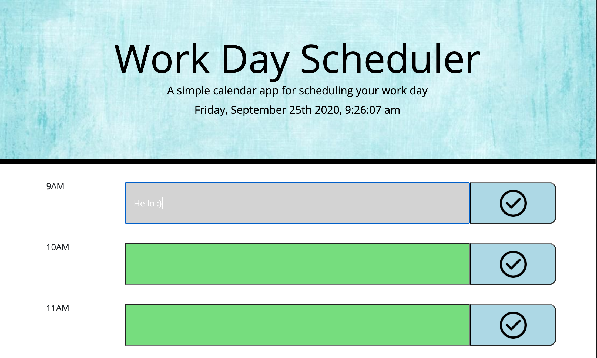

# Work Day Schedule

## Installation

Deployment:

https://jenryhennifer.github.io/workDaySchedule/

GitHub:

https://github.com/jenryhennifer/workDaySchedule


<hr />

# Technology used
* HTML
* BootStrap
* JavaScript
* JQuery
* GitLab
* GitHub

<hr />

## Sample Image

;

<hr />

## Description
The purpose of this project was to create a work day planner. The planner is used to make a schedule between 9 am and 5 pm. The top of the screen displays the current date and time. Each time block is color coded to indicate the past (gray), present (red), or future (green). When the user clicks the timeblock they have the opprotunity to type in a daily task. When the button is pressed, the information in the timeblock is saved to the local storage to allow the information to save in case the browser is closed.

I used moment.js to establish the current time onto the screen.

```
    moment().format('YYY-MM-DD')

    let todayTime = function(){
        let currentTime = moment().format('dddd, MMMM Do YYYY, h:mm:ss a');
        $('#currentDay').text(currentTime);
    }
    todayTime();
    setInterval(todayTime, 1000);
```

Each timeblock is separated with rows containing three columns identifying the time, tasks, and a button. The button is used to submit the task item to localStorage. This code was itterated for each timeblock:

```
        <div class = 'row'>
          <div class = 'col-md-2' id = 'time'>10AM</div>
          <input class = 'col-md-8 ten' id = 'tenInput'>
          <button class = 'saveBtn col-md-2' id = 'tenSubmit' type = 'button' ></button>
        </div>
```
The colors were determined by the current time:
```
    if (moment() > nineAM){
        $('.nine').addClass('past')
    }
    else if(moment().isBetween(nineAM,tenAM)){
        $('.nine').addClass('present')
    }
    else if(moment() < tenAM){
        $('.nine').addClass('future')
    }
```

## Growth
Unfortunately, I was having difficulties dynamically using JQUERY to shorten my code. GOOD NEWS! It all works. I plan to meet with a tutor next week to try to improve this project

<hr />

## License

MIT License

Copyright (c) 2020 Jennifer Henry

Permission is hereby granted, free of charge, to any person obtaining a copy of this software and associated documentation files (the "Software"), to deal in the Software without restriction, including without limitation the rights to use, copy, modify, merge, publish, distribute, sublicense, and/or sell copies of the Software, and to permit persons to whom the Software is furnished to do so, subject to the following conditions:

The above copyright notice and this permission notice shall be included in all copies or substantial portions of the Software.

THE SOFTWARE IS PROVIDED "AS IS", WITHOUT WARRANTY OF ANY KIND, EXPRESS OR IMPLIED, INCLUDING BUT NOT LIMITED TO THE WARRANTIES OF MERCHANTABILITY, FITNESS FOR A PARTICULAR PURPOSE AND NONINFRINGEMENT. IN NO EVENT SHALL THE AUTHORS OR COPYRIGHT HOLDERS BE LIABLE FOR ANY CLAIM, DAMAGES OR OTHER LIABILITY, WHETHER IN AN ACTION OF CONTRACT, TORT OR OTHERWISE, ARISING FROM, OUT OF OR IN CONNECTION WITH THE SOFTWARE OR THE USE OR OTHER DEALINGS IN THE SOFTWARE.

<hr />
<hr />

# Author

Jennifer Henry

* [LinkedIn](https://www.linkedin.com/in/jennifer-henry-4a540a149/)
* [GitHub](https://github.com/jenryhennifer)
* jenhenry1995@gmail.com